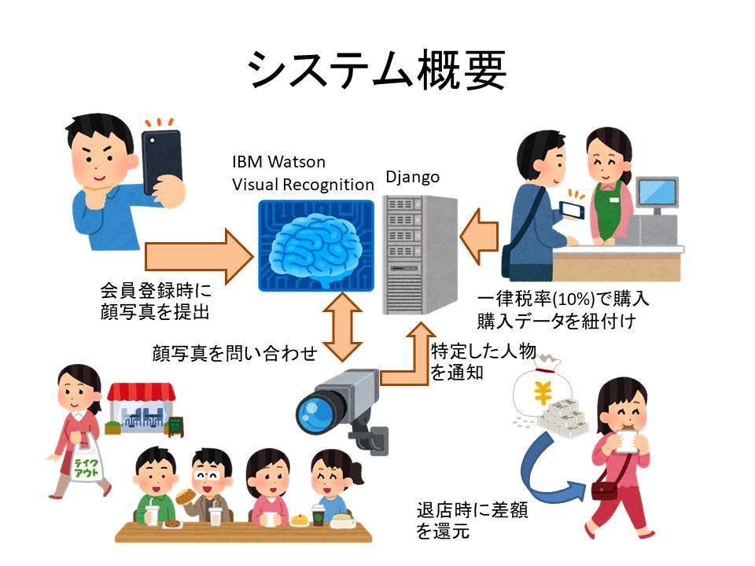

# ZESEI

## 製品概要
### 軽減税率 * Tech

### 背景（製品開発のきっかけ、課題等）
- 今年の10月に増税が行われその中にイートインとテイクアウトによって税率を変える**軽減税率制度**も始まった
- これによりコンビニで買ったものをテイクアウトの価格で支払ったにも関わらずイートインで食事をするという問題が起こると考える
- このシステムでは**税制問題を是正する**ことを目指して開発された

### 製品説明（具体的な製品の説明）
こちらに製品の概要・特徴について説明を記載してください。

### 特長

#### 1. 事前にユーザー登録をするときに顔画像を撮影する
バックグラウンドで画像データを学習し個別の顔画像を認識させる

#### 2. 定点カメラから顔画像を切り出し、個別の顔画像を認識しやすくする
背景など周りのノイズを除去し、画像認識の精度を上げる

#### 3. 退店したお客様を認識し、最終的な価格を求める
イートインを利用したかしていないかを判断し退店時に支払額との差額を還元する

### 解決出来ること
この製品を利用することによって最終的に解決できることについて記載をしてください。
- レジでは一律税率で会計を行い、定員の負担を減らすことが出来る
- 画像によって自動判断するので、自己申告に起因するトラブルを防止
- 還元には事前登録が必要なので会員登録を促進できる

### 今後の展望
今回は実現できなかったが、今後改善すること、どのように展開していくことが可能かについて記載をしてください。

## 開発内容・開発技術
### 活用した技術

#### フレームワーク・ライブラリ・モジュール
- python
- Django
- Open CV
- IBM Watson Visual Recognition
- LINE Pay

#### デバイス

### 独自開発技術（Hack Dayで開発したもの）
#### 2日間に開発した独自の機能・技術
* 独自で開発したものの内容をこちらに記載してください
* 特に力を入れた部分をファイルリンク、またはcommit_idを記載してください（任意）
